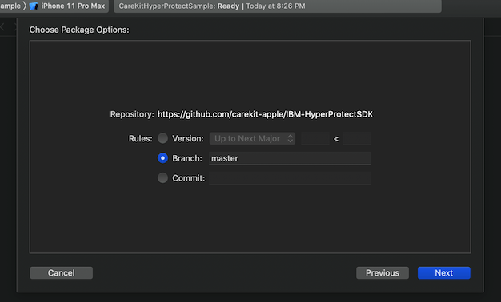

# IBM Hyper Protect SDK for iOS

This SDK implements CareKit's Remote Synchronization API and must be coupled with the backend SDK [IBM-HyperProtectMBaaS](https://github.com/carekit-apple/IBM-HyperProtectMBaaS) on the server side.

_Note, this is a pre-1.0 release and is still in beta_

### Roadmap

- [ ] Logging with OSLog
- [ ] OAuth2 support with JWT
- [ ] Bi-directional Synchronization of other high level entities (Contact, CarePlan, Patient)
- [ ] Comprehensive integration tests
- [ ] Comprehensive system tests
- [ ] OpenAPI Specification template
- [ ] IBM Cloud Starter Kit support
- [ ] Travis Build Support
- [ ] Large object support ( > 16 MB)
  

### Getting Started

This package can be imported into XCode using Swift Package Manager:





Now import the package with

```swift
import IBMHyperProtectSDK
```

and pass it in to your OCKStore:

```swift

let remote = IBMMongoRemote(/* credentials and connection information */)
let store = OCKStore(name: "SampleAppStore", type:
  inMemory, remote: remote)
```

By default if no backend API information is passed in, it will default to `https://localhost:3000` . Pass in the `apiLocation` parameter to point to your IBM Hyper Protect MBaaS deployed locally for development or in IBM Cloud. If the MBaaS is deployed to the IBM Cloud, a certificate may be needed to go through the authentication challenge. This certificate may be added to your project folder. If no value is passed into `certificate`, it will default to `carekit-root`.

### Contributing

We're always looking for contributors to help improve the CareKit and IBM Hyper Protect community. Please follow the [guide](./CONTRIBUTING.md)

### Known Issues:

* When using the IBM Hyper Protect SDK, you must also include CareKit in your app via SPM. Including CareKit using the traditional sub-project approach can cause runtime errors in the CoreData stack.
* As XCode and iOS prevent insecure connections by default, you *must* use SSL/TLS (https) for your connections. There are work-arounds but given that security is a core tennant of this SDK, we do not recommend skipping SSL/TLS, even in developement/testing.
* The backend of this SDK uses MongoDB which has a limit of 16 MB. An external object store must be used for objects larger than 16 MB (or segmented to fit the 16 MB limit).

### Self-Paced Lab:

Detailed end-to-end instructions for deploying the [IBM-HyperProtectMBaaS](https://github.com/carekit-apple/IBM-HyperProtectMBaaS) and the iOS SDK (this project) with a CareKit sample app are provided [here](https://github.com/THINKLab2020/carekit-hyperprotect-lab).